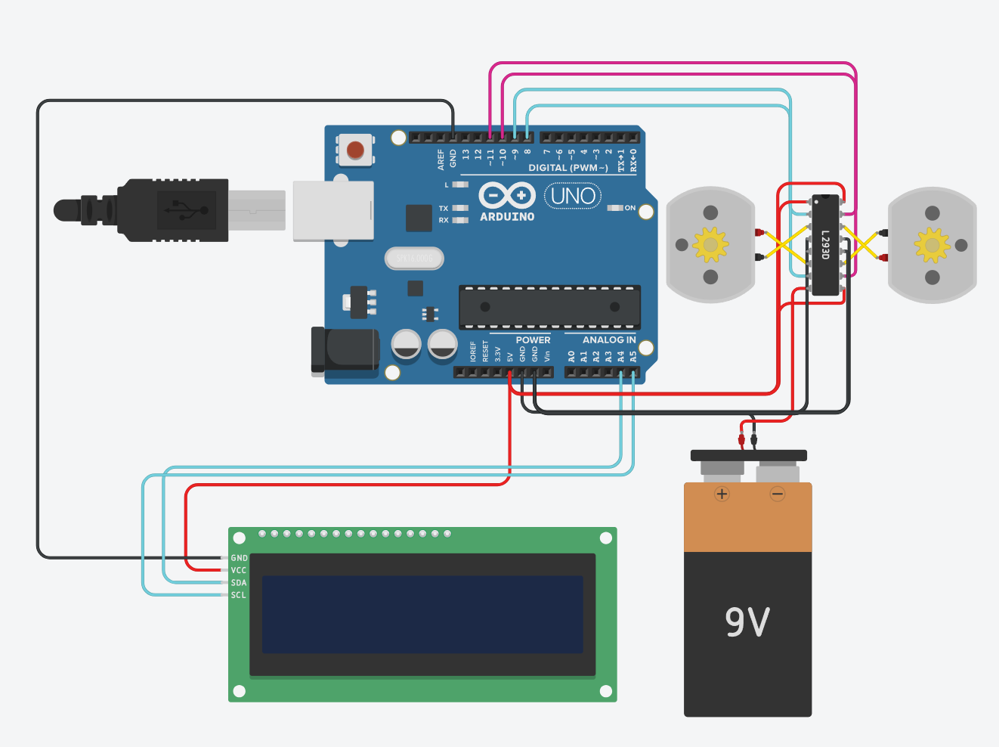
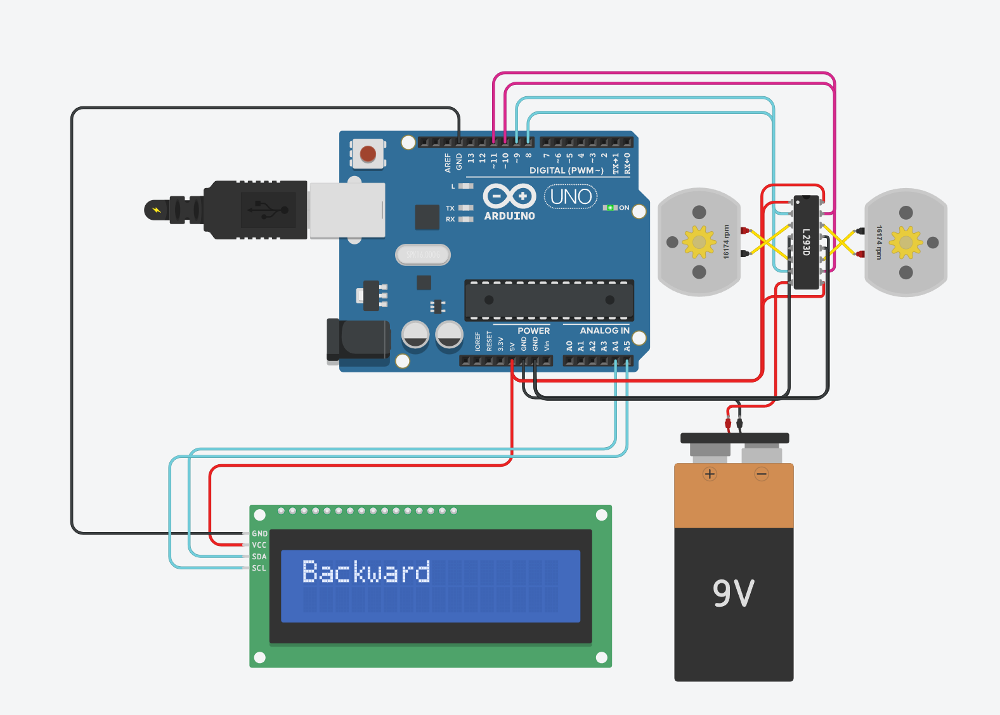
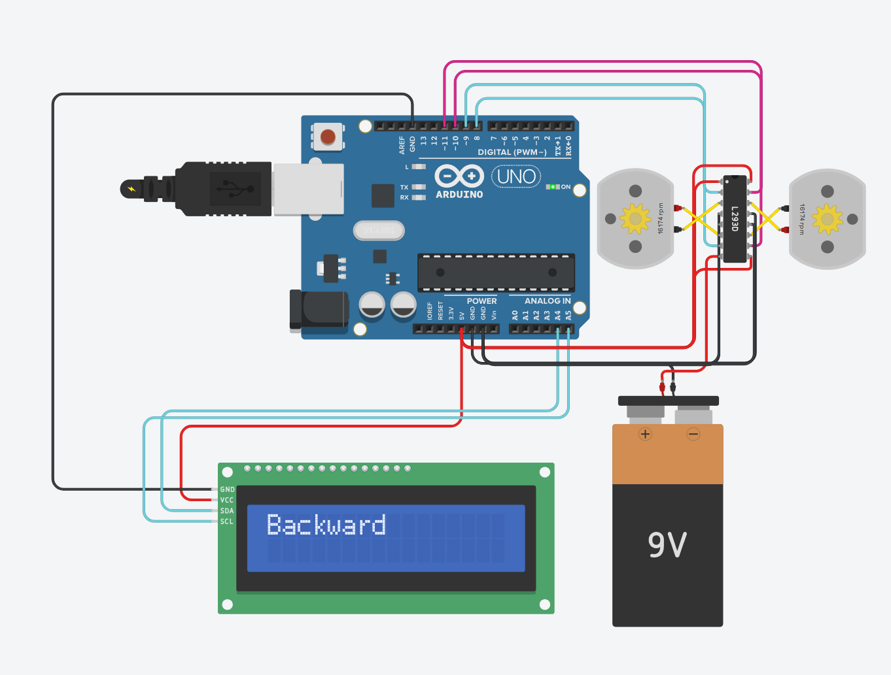
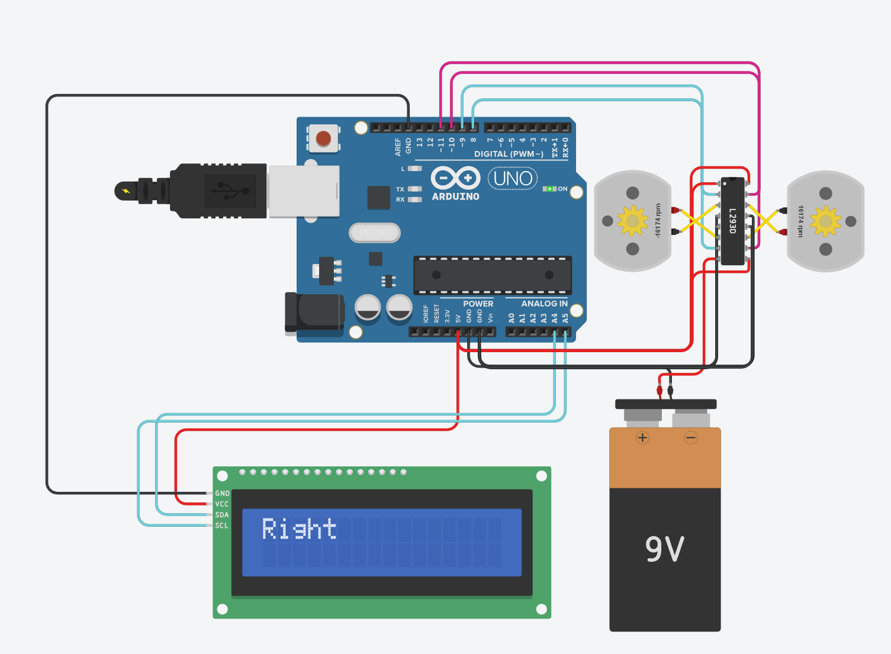
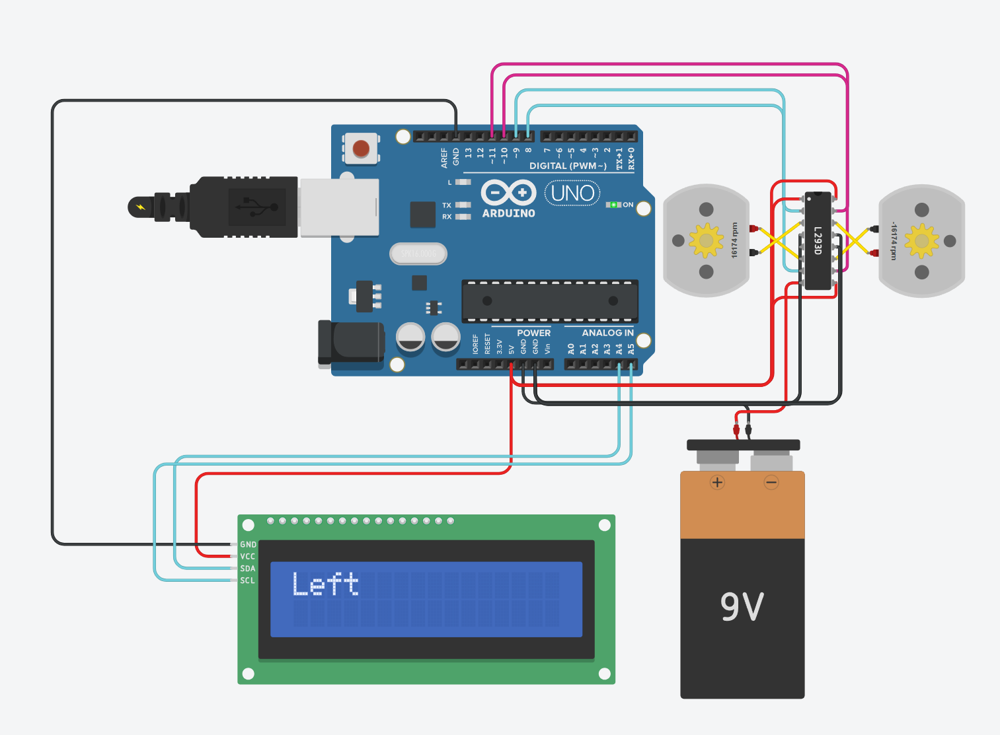

# Dual DC Motor Control with L293D & Arduino

## Project Overview
This project demonstrates how to control **two DC motors** using an **Arduino Uno** and an **L293D motor driver**, with real-time motion status displayed on an **I2C LCD screen**.

The system performs a sequence of movements:
- Move forward for 30 seconds  
- Move backward for 60 seconds  
- Alternate between right and left for 1 minute  

---

## Components Used
- Arduino Uno  
- L293D Motor Driver IC  
- 2x DC Motors  
- 16x2 LCD (I2C)  
- 9V Battery  
- Jumper Wires  

---

## Circuit Connections

### L293D Connections
- IN1 → Arduino Pin 8  
- IN2 → Arduino Pin 9  
- IN3 → Arduino Pin 10  
- IN4 → Arduino Pin 11  
- Enable 1,2 → 5V  
- Enable 3,4 → 5V  
- Vcc1 → 5V (Arduino)  
- Vcc2 → 9V Battery  
- GND → Common Ground  

### Motors
- Motor A → Outputs 1 & 2  
- Motor B → Outputs 3 & 4  

### LCD (I2C)
- VCC → 5V  
- GND → GND  
- SDA → A4  
- SCL → A5  

---

## Project Preview

<p align="center">
  
</p>

---

## How It Works
The Arduino sends digital signals to the L293D motor driver to control motor direction.

- HIGH/LOW signals determine the direction of each motor  
- Both motors work together to create movement (forward, backward, left, right)  
- The LCD displays the current motion in real time  

---

## Arduino Code

```cpp
#include <Wire.h>
#include <LiquidCrystal_I2C.h>

LiquidCrystal_I2C lcd(0x27, 16, 2);

// Motor pins
int IN1 = 8;
int IN2 = 9;
int IN3 = 10;
int IN4 = 11;

void setup() {
  pinMode(IN1, OUTPUT);
  pinMode(IN2, OUTPUT);
  pinMode(IN3, OUTPUT);
  pinMode(IN4, OUTPUT);

  lcd.init();
  lcd.backlight();
}

void forward() {
  lcd.clear();
  lcd.print("Forward");

  digitalWrite(IN1, HIGH);
  digitalWrite(IN2, LOW);
  digitalWrite(IN3, HIGH);
  digitalWrite(IN4, LOW);
}

void backward() {
  lcd.clear();
  lcd.print("Backward");

  digitalWrite(IN1, LOW);
  digitalWrite(IN2, HIGH);
  digitalWrite(IN3, LOW);
  digitalWrite(IN4, HIGH);
}

void right() {
  lcd.clear();
  lcd.print("Right");

  digitalWrite(IN1, HIGH);
  digitalWrite(IN2, LOW);
  digitalWrite(IN3, LOW);
  digitalWrite(IN4, HIGH);
}

void left() {
  lcd.clear();
  lcd.print("Left");

  digitalWrite(IN1, LOW);
  digitalWrite(IN2, HIGH);
  digitalWrite(IN3, HIGH);
  digitalWrite(IN4, LOW);
}

void loop() {
  forward();
  delay(30000);

  backward();
  delay(60000);

  for (int i = 0; i < 6; i++) {
    right();
    delay(5000);

    left();
    delay(5000);
  }
}
```
---

## LCD Output States

### Forward


### Backward


### Right


### Left

